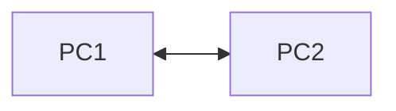
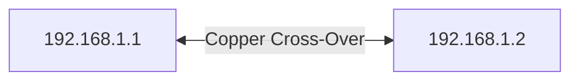
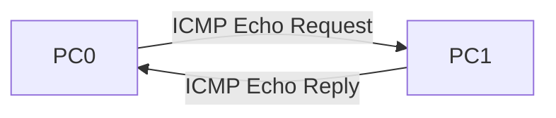

# 05. Peer-to-Peer (P2P) Network

> [!NOTE]
> Peer-to-Peer (P2P) Network হলো Computer Networks-এর সবচেয়ে সহজ Network Architecture। ছোট Office, Home Network এবং Lab Practice-এ এটি বেশি ব্যবহৃত হয়।

---

# Table of Contents

- What is Peer-to-Peer Network?
- Characteristics
- Architecture
- How It Works
- Packet Tracer Configuration
- IP Configuration
- Testing Connectivity
- Advantages
- Disadvantages
- P2P vs Client-Server
- Viva Questions
- Common Mistakes
- Quick Revision

---

# What is a Peer-to-Peer (P2P) Network?

**Peer-to-Peer (P2P)** হলো এমন একটি Network যেখানে **সব Computer সমান (Equal)**।

এখানে কোনো Dedicated Server থাকে না।

প্রতিটি Computer প্রয়োজনে **Client** এবং **Server**—দুইভাবেই কাজ করতে পারে।

> [!IMPORTANT]
> **No Dedicated Server = Peer-to-Peer Network**

---

# P2P Architecture



উভয় Computer সরাসরি একে অপরের সাথে Data Share করতে পারে।

---
# Characteristics

- No Dedicated Server
- All Computers are Equal
- Easy to Setup
- Low Cost
- Suitable for Small Networks
- Direct Resource Sharing

---

# How Peer-to-Peer Works

ধরো দুটি Computer আছে।

```text
PC1 ------------ PC2
```

PC1 একটি File Share করলো।

↓

PC2 সরাসরি File Access করলো।

↓

কোনো Server ব্যবহার হলো না।

---

# Packet Tracer Lab

## Step 1

Packet Tracer খুলুন।

---

## Step 2

দুটি PC নিন।

```text
PC0

PC1
```

---

## Step 3

Copper Cross-Over Cable দিয়ে Connect করুন।

```text
PC0 ----------- PC1
```

> [!TIP]
> Packet Tracer-এর Basic Lab-এ সাধারণত **Copper Cross-Over Cable** ব্যবহার করা হয়।

---

# IP Configuration

## PC0

```text
IP Address : 192.168.1.1

Subnet Mask : 255.255.255.0
```

---

## PC1

```text
IP Address : 192.168.1.2

Subnet Mask : 255.255.255.0
```

> [!IMPORTANT]
> দুইটি PC-কে একই Network-এর IP দিতে হবে।

---
# Network Diagram



---
# Testing Connectivity

PC0-এর Command Prompt খুলে লিখুন—

```bash
ping 192.168.1.2
```

যদি নিচের মতো Reply আসে—

```text
Reply from 192.168.1.2

Bytes=32

Time<1ms

TTL=128
```

তাহলে Connection সফল।

---

# Ping Flow



---