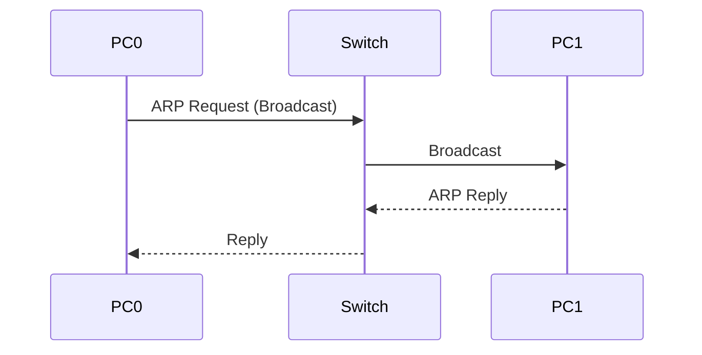
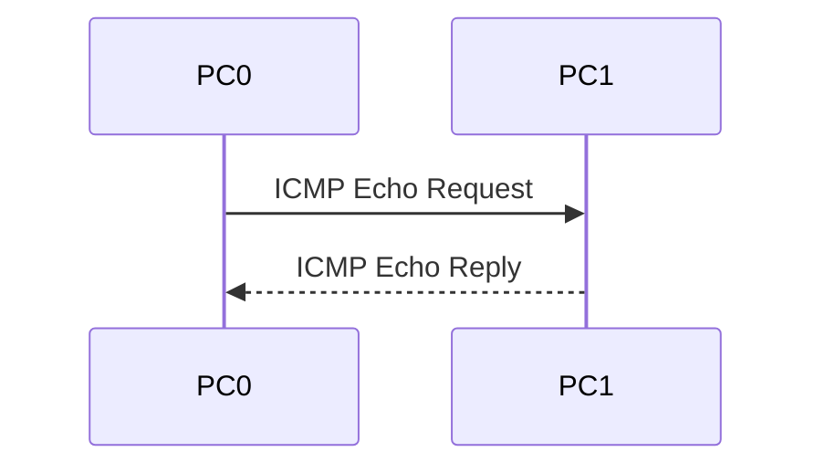

# 06. ARP & ICMP

> [!NOTE]
> ARP এবং ICMP হলো Network Communication-এর দুটি গুরুত্বপূর্ণ Protocol। Packet Tracer-এর Simulation Mode-এ এগুলোর Packet Flow দেখা যায়।

---

# Table of Contents

- What is ARP?
- Why ARP is Needed?
- How ARP Works
- ARP Request
- ARP Reply
- ARP Cache
- What is ICMP?
- Ping
- Tracert
- ARP vs ICMP
- Packet Flow
- Viva Questions
- Common Mistakes
- Quick Revision

---
# What is ARP?

**ARP (Address Resolution Protocol)** এমন একটি Protocol যা **IP Address থেকে MAC Address খুঁজে বের করে।**

> [!IMPORTANT]
> **ARP = IP → MAC**

Example:

```text
IP Address

192.168.1.10

↓

MAC Address

00:1A:2B:3C:4D:5E
```

---

# Why ARP is Needed?

Switch Data Forward করার জন্য **MAC Address** ব্যবহার করে।

কিন্তু আমরা সাধারণত জানি **IP Address**।

তাই Communication শুরু হওয়ার আগে IP থেকে MAC বের করতে ARP ব্যবহার করা হয়।

---

# How ARP Works

ধরো,

```text
PC0

192.168.1.1
```

চাইছে

```text
PC1

192.168.1.2
```

কিন্তু PC0 জানে না PC1-এর MAC Address।

তখন—

### Step 1

PC0 একটি **ARP Request Broadcast** পাঠায়।

```
Who has 192.168.1.2 ?
Tell 192.168.1.1
```

↓

### Step 2

সব Device Request পায়।

↓

### Step 3

শুধু PC1 Reply দেয়।

```
192.168.1.2 is at

AA:BB:CC:DD:EE:FF
```

↓

### Step 4

PC0 MAC Address Save করে।

↓

Communication শুরু হয়।

---

# ARP Packet Flow



---
# ARP Request

ARP Request সব Device-এর কাছে যায়।

এটি একটি **Broadcast Message**।

---
# ARP Reply

ARP Reply শুধুমাত্র Request করা Device-এর কাছে যায়।

এটি **Unicast Message**।

---

# ARP Cache

একবার MAC Address পাওয়ার পরে Computer সেটি কিছু সময়ের জন্য **ARP Cache**-এ সংরক্ষণ করে।

এর ফলে বারবার ARP Request পাঠাতে হয় না।

Windows-এ দেখতে—

```bash
arp -a
```

---

# What is ICMP?

**ICMP (Internet Control Message Protocol)** হলো এমন একটি Protocol যা Network Error Report এবং Connection Test-এর জন্য ব্যবহৃত হয়।

---

# Ping

Ping Command ব্যবহার করা হয় Network Connection ঠিক আছে কিনা পরীক্ষা করার জন্য।

Ping ICMP ব্যবহার করে।

Example

```bash
ping 192.168.1.2
```

Successful হলে—

```text
Reply from 192.168.1.2

Bytes=32

Time<1ms

TTL=128
```

---

# Ping Packet Flow



---
# Tracert

Tracert Command ব্যবহার করা হয় Packet কোন কোন Router অতিক্রম করে Destination-এ পৌঁছায় তা দেখার জন্য।

Command

```bash
tracert google.com
```

---
# ICMP Messages

কিছু গুরুত্বপূর্ণ ICMP Message—

- Echo Request
- Echo Reply
- Destination Unreachable
- Time Exceeded

---

# ARP vs ICMP

| ARP | ICMP |
|------|------|
| IP → MAC খুঁজে বের করে | Connection Test করে |
| Local Network-এ কাজ করে | Network Diagnostic করে |
| MAC Address নিয়ে কাজ করে | Error Message পাঠায় |
| Broadcast Request | Echo Request/Reply |

---
# ARP + Ping Complete Flow

```text
PC0
 │
 │ Ping 192.168.1.2
 │
 ▼

ARP Request

↓

ARP Reply

↓

MAC Found

↓

ICMP Echo Request

↓

ICMP Echo Reply

↓

Ping Successful
```

---
# Packet Tracer Simulation

Simulation Mode-এ সাধারণত দেখা যায়—

- ARP Request
- ARP Reply
- ICMP Echo Request
- ICMP Echo Reply

এগুলো পর্যায়ক্রমে ঘটে।

---

# Viva Questions

### 1. ARP-এর পূর্ণরূপ কী?

Address Resolution Protocol

---

### 2. ARP কী কাজ করে?

IP Address থেকে MAC Address বের করে।

---

### 3. ARP Request Broadcast নাকি Unicast?

Broadcast

---

### 4. ARP Reply Broadcast নাকি Unicast?

Unicast

---

### 5. ICMP-এর পূর্ণরূপ কী?

Internet Control Message Protocol

---

### 6. Ping কোন Protocol ব্যবহার করে?

ICMP

---

### 7. Ping-এর কাজ কী?

Network Connection পরীক্ষা করা।

---

### 8. arp -a Command-এর কাজ কী?

ARP Cache দেখায়।

---

### 9. Tracert-এর কাজ কী?

Packet কোন কোন Router দিয়ে যায় তা দেখায়।

---

### 10. Communication-এর আগে ARP কেন দরকার?

কারণ Switch MAC Address ব্যবহার করে, তাই Destination-এর MAC জানা প্রয়োজন।

---