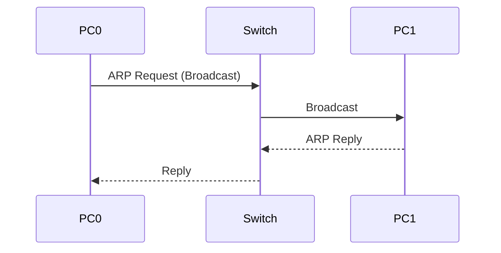

# 06. ARP & ICMP

> [!NOTE]
> ARP এবং ICMP হলো Network Communication-এর দুটি গুরুত্বপূর্ণ Protocol। Packet Tracer-এর Simulation Mode-এ এগুলোর Packet Flow দেখা যায়।

---

# Table of Contents

- What is ARP?
- Why ARP is Needed?
- How ARP Works
- ARP Request
- ARP Reply
- ARP Cache
- What is ICMP?
- Ping
- Tracert
- ARP vs ICMP
- Packet Flow
- Viva Questions
- Common Mistakes
- Quick Revision

---
# What is ARP?

**ARP (Address Resolution Protocol)** এমন একটি Protocol যা **IP Address থেকে MAC Address খুঁজে বের করে।**

> [!IMPORTANT]
> **ARP = IP → MAC**

Example:

```text
IP Address

192.168.1.10

↓

MAC Address

00:1A:2B:3C:4D:5E
```

---

# Why ARP is Needed?

Switch Data Forward করার জন্য **MAC Address** ব্যবহার করে।

কিন্তু আমরা সাধারণত জানি **IP Address**।

তাই Communication শুরু হওয়ার আগে IP থেকে MAC বের করতে ARP ব্যবহার করা হয়।

---

# How ARP Works

ধরো,

```text
PC0

192.168.1.1
```

চাইছে

```text
PC1

192.168.1.2
```

কিন্তু PC0 জানে না PC1-এর MAC Address।

তখন—

### Step 1

PC0 একটি **ARP Request Broadcast** পাঠায়।

```
Who has 192.168.1.2 ?
Tell 192.168.1.1
```

↓

### Step 2

সব Device Request পায়।

↓

### Step 3

শুধু PC1 Reply দেয়।

```
192.168.1.2 is at

AA:BB:CC:DD:EE:FF
```

↓

### Step 4

PC0 MAC Address Save করে।

↓

Communication শুরু হয়।

---

# ARP Packet Flow



---
# ARP Request

ARP Request সব Device-এর কাছে যায়।

এটি একটি **Broadcast Message**।

---
# ARP Reply

ARP Reply শুধুমাত্র Request করা Device-এর কাছে যায়।

এটি **Unicast Message**।

---

# ARP Cache

একবার MAC Address পাওয়ার পরে Computer সেটি কিছু সময়ের জন্য **ARP Cache**-এ সংরক্ষণ করে।

এর ফলে বারবার ARP Request পাঠাতে হয় না।

Windows-এ দেখতে—

```bash
arp -a
```

---