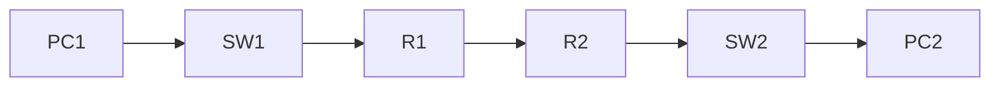

# 08. Dynamic Routing using RIP

> [!NOTE]
> RIP (Routing Information Protocol) হলো একটি **Dynamic Routing Protocol**। এটি Router-কে স্বয়ংক্রিয়ভাবে Route শিখতে সাহায্য করে।

---

# Table of Contents

- What is Routing?
- Static vs Dynamic Routing
- What is RIP?
- Features of RIP
- Hop Count
- How RIP Works
- Network Topology
- RIP Configuration
- Verification Commands
- Advantages
- Disadvantages
- Common Errors
- Viva Questions
- Quick Revision

---
# What is Routing?

**Routing** হলো একটি Network থেকে অন্য Network-এ Data পাঠানোর জন্য সঠিক পথ (Route) নির্বাচন করার প্রক্রিয়া।

Router এই কাজটি করে।

Example

```text
PC → Switch → Router → Switch → PC
```

---

# Static Routing vs Dynamic Routing

| Static Routing | Dynamic Routing |
|---------------|-----------------|
| Route নিজে লিখতে হয় | Route নিজে নিজে শেখে |
| ছোট Network | বড় Network |
| কম Flexible | বেশি Flexible |
| Manual | Automatic |

> [!IMPORTANT]
> **Static Routing = Manual**
>
> **Dynamic Routing = Automatic**

---
# What is RIP?

**RIP (Routing Information Protocol)** হলো একটি Dynamic Routing Protocol।

এটি Router-দের মধ্যে Routing Information Exchange করে।

---

# Features of RIP

- Dynamic Routing Protocol
- Distance Vector Protocol
- Metric হিসেবে Hop Count ব্যবহার করে
- Maximum Hop Count = 15
- Hop 16 = Unreachable
- সহজ Configuration
- ছোট Network-এর জন্য উপযুক্ত

---

# What is Hop Count?

**Hop Count** মানে Source থেকে Destination-এ যেতে কতগুলো Router অতিক্রম করতে হয়।

Example

```text
PC

↓

Router1

↓

Router2

↓

Router3

↓

PC
```

Hop Count = **3**

---
# RIP Metric

| Hop Count | Status |
|-----------|---------|
| 1 | Best Route |
| 2 | Good |
| 5 | Acceptable |
| 15 | Maximum |
| 16 | Unreachable |

> [!WARNING]
> RIP-এ **16 Hop** মানে Destination-এ পৌঁছানো যাবে না।

---
# How RIP Works

1. Router নিজের Connected Network চিনে।
2. পাশের Router-কে সেই তথ্য পাঠায়।
3. পাশের Router নতুন Route শিখে।
4. Routing Table Update হয়।
5. সব Router Route শিখে ফেলে।

---

# Network Diagram



---
