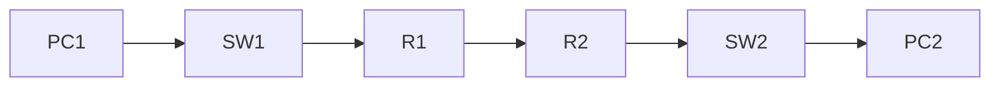

# 08. Dynamic Routing using RIP

> [!NOTE]
> RIP (Routing Information Protocol) হলো একটি **Dynamic Routing Protocol**। এটি Router-কে স্বয়ংক্রিয়ভাবে Route শিখতে সাহায্য করে।

---

# Table of Contents

- What is Routing?
- Static vs Dynamic Routing
- What is RIP?
- Features of RIP
- Hop Count
- How RIP Works
- Network Topology
- RIP Configuration
- Verification Commands
- Advantages
- Disadvantages
- Common Errors
- Viva Questions
- Quick Revision

---
# What is Routing?

**Routing** হলো একটি Network থেকে অন্য Network-এ Data পাঠানোর জন্য সঠিক পথ (Route) নির্বাচন করার প্রক্রিয়া।

Router এই কাজটি করে।

Example

```text
PC → Switch → Router → Switch → PC
```

---

# Static Routing vs Dynamic Routing

| Static Routing | Dynamic Routing |
|---------------|-----------------|
| Route নিজে লিখতে হয় | Route নিজে নিজে শেখে |
| ছোট Network | বড় Network |
| কম Flexible | বেশি Flexible |
| Manual | Automatic |

> [!IMPORTANT]
> **Static Routing = Manual**
>
> **Dynamic Routing = Automatic**

---
# What is RIP?

**RIP (Routing Information Protocol)** হলো একটি Dynamic Routing Protocol।

এটি Router-দের মধ্যে Routing Information Exchange করে।

---

# Features of RIP

- Dynamic Routing Protocol
- Distance Vector Protocol
- Metric হিসেবে Hop Count ব্যবহার করে
- Maximum Hop Count = 15
- Hop 16 = Unreachable
- সহজ Configuration
- ছোট Network-এর জন্য উপযুক্ত

---

# What is Hop Count?

**Hop Count** মানে Source থেকে Destination-এ যেতে কতগুলো Router অতিক্রম করতে হয়।

Example

```text
PC

↓

Router1

↓

Router2

↓

Router3

↓

PC
```

Hop Count = **3**

---
# RIP Metric

| Hop Count | Status |
|-----------|---------|
| 1 | Best Route |
| 2 | Good |
| 5 | Acceptable |
| 15 | Maximum |
| 16 | Unreachable |

> [!WARNING]
> RIP-এ **16 Hop** মানে Destination-এ পৌঁছানো যাবে না।

---
# How RIP Works

1. Router নিজের Connected Network চিনে।
2. পাশের Router-কে সেই তথ্য পাঠায়।
3. পাশের Router নতুন Route শিখে।
4. Routing Table Update হয়।
5. সব Router Route শিখে ফেলে।

---

# Network Diagram



---
# Example IP Addressing

## Router 1

```text
LAN

192.168.1.0/24

Serial

10.0.0.1/30
```

---

## Router 2

```text
LAN

192.168.2.0/24

Serial

10.0.0.2/30
```

---

# RIP Configuration

## Router 1

```bash
enable

configure terminal

router rip

version 2

network 192.168.1.0

network 10.0.0.0

no auto-summary

end
```

---

## Router 2

```bash
enable

configure terminal

router rip

version 2

network 192.168.2.0

network 10.0.0.0

no auto-summary

end
```

> [!IMPORTANT]
> RIP Version 2 ব্যবহার করাই ভালো, কারণ এটি CIDR/VLSM Support করে।

---

# Verify RIP

Routing Table দেখার জন্য—

```bash
show ip route
```

---

RIP Configuration দেখার জন্য—

```bash
show running-config
```

---

RIP Information দেখার জন্য—

```bash
show ip protocols
```

---

# Communication Flow

```text
PC1

↓

Switch

↓

Router1

↓

Router2

↓

Switch

↓

PC2
```

---

# Advantages

- Automatic Routing
- Easy Configuration
- Route Automatically Update হয়
- Small Network-এর জন্য ভালো
- Manual Route লিখতে হয় না

---
# Disadvantages

- Slow Convergence
- Maximum 15 Hop
- Large Network-এর জন্য উপযুক্ত নয়
- Bandwidth বেশি ব্যবহার করতে পারে

---

# Common Errors

> [!WARNING]
> ভুল Network Address দিলে RIP Route শিখবে না।

---

> [!WARNING]
> দুই Router-এ RIP Enable না করলে Communication হবে না।

---

> [!WARNING]
> Interface Down থাকলে Route Exchange হবে না।

---

> [!WARNING]
> ভুল IP Address বা Subnet Mask দিলে Ping Fail করবে।

---
# Troubleshooting Checklist

Ping না হলে—

- Cable ঠিক আছে?
- Interface Up?
- no shutdown দিয়েছ?
- IP Address ঠিক?
- Subnet Mask ঠিক?
- RIP Enable?
- Network Command ঠিক?
- show ip route-এ Route এসেছে?

---

# Viva Questions

### 1. RIP-এর পূর্ণরূপ কী?

Routing Information Protocol

---

### 2. RIP কী?

একটি Dynamic Routing Protocol।

---

### 3. RIP কোন ধরনের Routing Protocol?

Distance Vector Routing Protocol।

---

### 4. RIP কোন Metric ব্যবহার করে?

Hop Count।

---

### 5. RIP-এর Maximum Hop Count কত?

15

---

### 6. Hop Count 16 হলে কী হয়?

Destination Unreachable।

---

### 7. Routing Table দেখার Command কী?

```bash
show ip route
```

---

### 8. RIP Configuration শুরু করার Command কী?

```bash
router rip
```

---

### 9. RIP Version 2 কেন ব্যবহার করা হয়?

CIDR ও VLSM Support করার জন্য।

---

### 10. Dynamic Routing-এর সুবিধা কী?

Route Automatically Update হয়।

---

# Quick Revision

- RIP = Routing Information Protocol
- Dynamic Routing Protocol
- Distance Vector Protocol
- Metric = Hop Count
- Maximum Hop = 15
- Hop 16 = Unreachable
- `router rip` = RIP Enable
- `version 2` = RIP v2
- `network` = Advertise Network
- `show ip route` = Routing Table

---

# Exam Tips

> [!TIP]
> Lab Viva-তে সবচেয়ে Common প্রশ্ন:
>
> - RIP-এর পূর্ণরূপ কী?
> - RIP কোন Metric ব্যবহার করে?
> - Maximum Hop Count কত?
> - Hop 16 মানে কী?
> - `show ip route` Command-এর কাজ কী?

> [!IMPORTANT]
> শুধু Command মুখস্থ করলেই হবে না। **কেন `network` Command দিতে হয়**, **কেন `version 2` ব্যবহার করা হয়**, আর **Hop Count কীভাবে Route নির্বাচন করে**—এগুলোও বুঝে রাখবে।