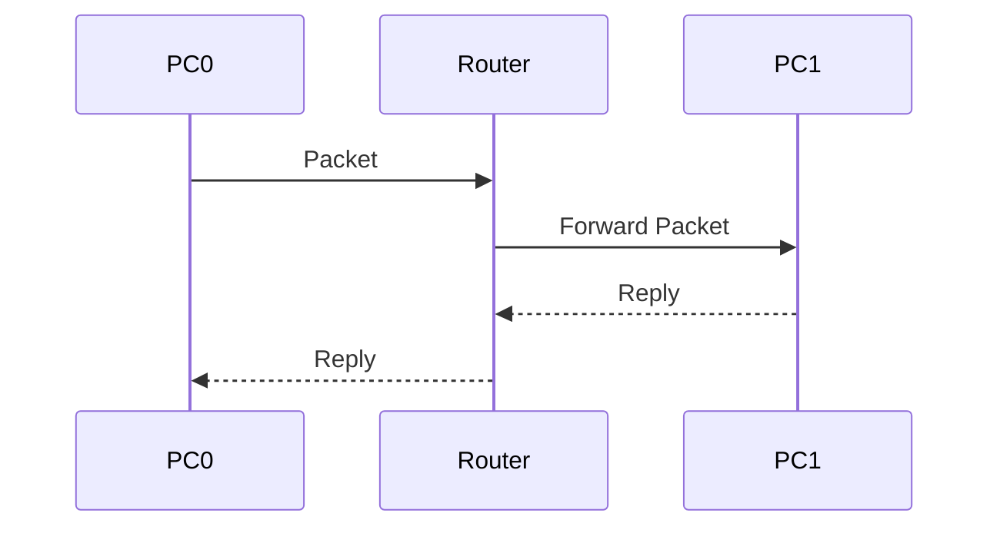

# 07. Connecting Different LAN Using Router

> [!NOTE]
> একটি Router ব্যবহার করে দুই বা ততোধিক ভিন্ন Network (LAN)-কে একে অপরের সাথে যুক্ত করা যায়।

---

# Table of Contents

- What is a Router?
- Why Do We Need a Router?
- Same LAN vs Different LAN
- Router Interfaces
- Default Gateway
- Basic Network Diagram
- Router Configuration
- PC Configuration
- Testing the Network
- Common Errors
- Viva Questions
- Quick Revision

---

# What is a Router?

**Router** হলো একটি **Layer 3 (Network Layer)** Device, যা **IP Address** ব্যবহার করে এক Network থেকে অন্য Network-এ Data পাঠায়।

### Main Functions

- Different LAN Connect করা
- Best Path নির্বাচন করা
- Packet Forward করা
- Internet-এর সাথে সংযোগ দেওয়া

> [!IMPORTANT]
> Router **MAC Address নয়**, **IP Address** দেখে Packet Forward করে।

---

# Why Do We Need a Router?

একই Network-এর Device-গুলো Switch দিয়ে যোগাযোগ করতে পারে।

কিন্তু যদি দুইটি Device **Different Network**-এ থাকে, তাহলে Router ছাড়া তারা যোগাযোগ করতে পারবে না।

### Example

```text
PC0 → 192.168.1.10

PC1 → 192.168.2.10
```

এরা Different Network-এ আছে।

তাই Router দরকার।

---

# Same LAN vs Different LAN

| Same LAN | Different LAN |
|----------|---------------|
| Switch যথেষ্ট | Router লাগবে |
| Gateway দরকার নাও হতে পারে | Default Gateway অবশ্যই লাগবে |
| সরাসরি Ping সম্ভব | Router ছাড়া Ping হবে না |

---

# Router Interfaces

Router-এর বিভিন্ন Port-কে **Interface** বলা হয়।

উদাহরণ:

- GigabitEthernet0/0
- GigabitEthernet0/1
- FastEthernet0/0
- FastEthernet0/1

প্রতিটি Interface-এ আলাদা IP Address দেওয়া যায়।

---

# Default Gateway

**Default Gateway** হলো Router-এর Interface-এর IP Address।

যখন কোনো PC অন্য Network-এ Data পাঠাতে চায়, তখন প্রথমে Packet Gateway-এর কাছে যায়।

### Example

```text
PC IP

192.168.1.10

Gateway

192.168.1.1
```

---

# Network Diagram


---

# IP Addressing

## LAN 1

| Device | IP Address |
|---------|------------|
| PC0 | 192.168.1.10 |
| Router G0/0 | 192.168.1.1 |

---

## LAN 2

| Device | IP Address |
|---------|------------|
| PC1 | 192.168.2.10 |
| Router G0/1 | 192.168.2.1 |

---
# Router Configuration

Router CLI-তে লিখুন—

```bash
enable

configure terminal

interface gigabitEthernet0/0

ip address 192.168.1.1 255.255.255.0

no shutdown

exit

interface gigabitEthernet0/1

ip address 192.168.2.1 255.255.255.0

no shutdown

exit

end
```

> [!IMPORTANT]
> `no shutdown` না দিলে Interface চালু হবে না।

---
# PC Configuration

## PC0

```text
IP Address

192.168.1.10

Subnet Mask

255.255.255.0

Default Gateway

192.168.1.1
```

---

## PC1

```text
IP Address

192.168.2.10

Subnet Mask

255.255.255.0

Default Gateway

192.168.2.1
```

---

# Communication Flow



---

# Testing the Network

PC0 থেকে—

```bash
ping 192.168.2.10
```

যদি Reply আসে—

```text
Reply from 192.168.2.10
```

তাহলে Configuration সঠিক।

---

# Common Errors

> [!WARNING]
> Router Interface-এ `no shutdown` না দিলে Interface **Administratively Down** থাকবে।

---

> [!WARNING]
> ভুল Default Gateway দিলে Different LAN-এ Ping হবে না।

---

> [!WARNING]
> ভুল Subnet Mask দিলে Communication Fail করবে।

---

> [!WARNING]
> Router Interface-এ ভুল IP Address দিলে Routing হবে না।

---

# Troubleshooting Checklist

Ping না হলে নিচের বিষয়গুলো পরীক্ষা করো—

- Cable ঠিক আছে?
- Router Interface Up আছে?
- `no shutdown` দিয়েছ?
- IP Address ঠিক?
- Subnet Mask ঠিক?
- Default Gateway ঠিক?
- Router Interface-এর IP ঠিক?

---\
# Viva Questions

### 1. Router কী?

Router হলো Layer 3 Device, যা Different Network Connect করে।

---

### 2. Router কোন Address ব্যবহার করে?

IP Address

---

### 3. Router কোন Layer-এ কাজ করে?

Layer 3 (Network Layer)

---

### 4. Default Gateway কী?

Router-এর Interface-এর IP Address।

---

### 5. Different LAN Connect করতে কী লাগে?

Router

---

### 6. `no shutdown` Command-এর কাজ কী?

Interface চালু (Enable) করা।

---

### 7. Router Configuration Mode-এ যেতে কোন Command ব্যবহার করা হয়?

```bash
configure terminal
```

---

### 8. Interface Configure করতে কোন Command ব্যবহার করা হয়?

```bash
interface gigabitEthernet0/0
```

---

### 9. Ping কেন ব্যবহার করা হয়?

Network Connection পরীক্ষা করার জন্য।

---

### 10. Router কেন দরকার?

Different Network-এর মধ্যে Communication করার জন্য।

---

# Quick Revision

- Router = Layer 3 Device
- Router = Uses IP Address
- Different LAN = Router Required
- Default Gateway = Router IP
- `enable` = Privileged Mode
- `configure terminal` = Global Configuration
- `interface g0/0` = Interface Select
- `ip address` = Assign IP
- `no shutdown` = Enable Interface
- `ping` = Test Connectivity

---

# Exam Tips

> [!TIP]
> Lab Exam-এ সবচেয়ে বেশি ভুল হয় **Default Gateway** এবং **no shutdown** Command-এ। এগুলো অবশ্যই মনে রাখবে।

> [!IMPORTANT]
> মনে রাখার Shortcut:
>
> - **Switch → Same LAN**
> - **Router → Different LAN**
> - **Switch → MAC Address**
> - **Router → IP Address**
> - **Gateway = Router-এর IP**