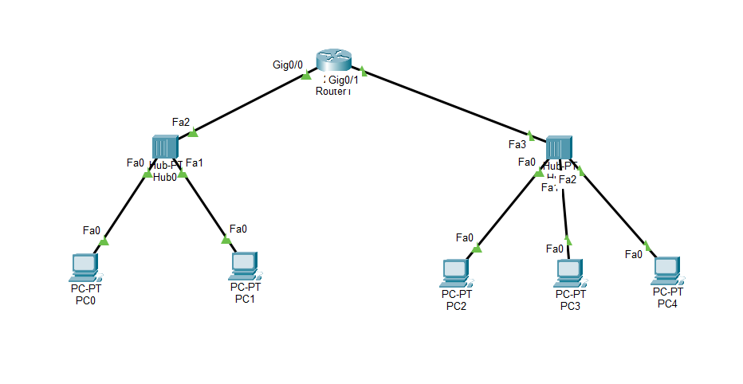

# 🔌 Connecting Two Different LANs using a Router (Packet Tracer Lab)


> এই নোটটা আমার CN (Computer Networking) Lab এর কাজ থেকে বানানো — একটা রাউটার দিয়ে দুইটা আলাদা LAN (Hub সহ) কানেক্ট করার ধাপে ধাপে গাইড। পরে যেকোনো সময় চোখ বুলিয়ে পুরো সেটআপ মনে করে নেওয়া যাবে।

---


## Connection in Cisco Packet Tracer:



---

## 📑 Table of Contents

| # | Section |
|---|---------|
| 1 | [Overview](#overview) |
| 2 | [Physical Setup (Devices)](#physical-setup) |
| 3 | [Cabling](#cabling) |
| 4 | [IP Planning](#ip-planning) |
| 5 | [PC Configuration](#pc-configuration) |
| 6 | [Router Configuration](#router-configuration) |
| 7 | [Testing the Connection](#testing) |
| 8 | [Quick Reference Table](#quick-reference) |
| 9 | [Common Mistakes / Tips](#tips) |

---

<a id="overview"></a>
## 1️⃣ Overview

দুইটা আলাদা LAN network (একটা বাম পাশে, একটা ডান পাশে) — মাঝখানে একটা **Router** বসিয়ে একসাথে কানেক্ট করা হবে। প্রতিটা পাশে একটা করে **Hub** থাকবে, যার সাথে কয়েকটা PC কানেক্ট থাকবে।

```
[PC1]                                      [PC3]
[PC2] --- Hub(Left) --- Router --- Hub(Right) --- [PC4]
                                                    [PC5]

  192.168.1.x                              192.168.2.x
  Gateway: .1.1                            Gateway: .2.1
```

---

<a id="physical-setup"></a>
## 2️⃣ Physical Setup (Devices বসানো)

1. নিচে বাম কোণায় **Network Devices** → **Routers** সিলেক্ট করে একটা Router (যেমন: `2911` বা `4331`) টেনে মাঝখানে আনো।
2. **Hubs** সিলেক্ট করে দুইটা Hub টেনে দুই পাশে বসাও (বাম পাশে একটা, ডান পাশে একটা)।
3. **End Devices** → **PC** সিলেক্ট করে:
   - বাম পাশের Hub এর নিচে **২টা PC**
   - ডান পাশের Hub এর নিচে **৩টা PC**

---

<a id="cabling"></a>
## 3️⃣ Cabling (তার দিয়ে কানেক্ট করা)

1. নিচে **Connections** (বজ্রপাত আইকন) এ ক্লিক করো।
2. **Copper Straight-Through** তার সিলেক্ট করো (কালো সোজা দাগ)।
3. সব PC → পাশের Hub এর সাথে কানেক্ট করো:
   - PC তে ক্লিক করে `FastEthernet0`
   - Hub তে ক্লিক করে যেকোনো একটা পোর্ট
4. বাম পাশের Hub → Router এর `GigabitEthernet 0/0` পোর্টের সাথে কানেক্ট করো।
5. ডান পাশের Hub → Router এর `GigabitEthernet 0/1` পোর্টের সাথে কানেক্ট করো।

> ⚠️ **নোট:** এখন Router এর কাছের বাতিগুলো লাল থাকবে — এটা স্বাভাবিক, ইন্টারফেস এখনো `On` করা হয়নি। ধাপ ৫ এ ঠিক হয়ে যাবে।

---

<a id="ip-planning"></a>
## 4️⃣ IP Planning

Router দুইটা আলাদা network কে কানেক্ট করে, তাই আইপি ভাগ করে নেওয়া হবে:

| Network | IP Range | Gateway |
|---|---|---|
| বাম পাশ (Left) | `192.168.1.x` | `192.168.1.1` |
| ডান পাশ (Right) | `192.168.2.x` | `192.168.2.1` |

---

<a id="pc-configuration"></a>
## 5️⃣ PC Configuration

প্রতিটা PC তে ক্লিক করে → **Desktop** ট্যাব → **IP Configuration**:

**বাম পাশের PC গুলো:**

| PC | IP Address | Default Gateway |
|---|---|---|
| PC1 | `192.168.1.2` | `192.168.1.1` |
| PC2 | `192.168.1.3` | `192.168.1.1` |

**ডান পাশের PC গুলো:**

| PC | IP Address | Default Gateway |
|---|---|---|
| PC3 | `192.168.2.2` | `192.168.2.1` |
| PC4 | `192.168.2.3` | `192.168.2.1` |
| PC5 | `192.168.2.4` | `192.168.2.1` |

> Subnet Mask ফিল্ডে ক্লিক করলেই অটো আসবে (`255.255.255.0`)। Default Gateway অবশ্যই সঠিকভাবে সেট করতে হবে — এটা মাস্ট।

---

<a id="router-configuration"></a>
## 6️⃣ Router Configuration (GUI দিয়ে)

এখানেই আসল কাজ — Router এর লাল বাতি সবুজ হবে:

1. Router এর উপর ক্লিক করো → উপরে **Config** ট্যাবে যাও।
2. বাম পাশে **Interface** এর নিচে `GigabitEthernet 0/0` এ ক্লিক করো:
   - **Port Status** → `On` টিক দাও (বাম পাশ সবুজ হয়ে যাবে)
   - **IP Address**: `192.168.1.1`
3. এবার `GigabitEthernet 0/1` এ ক্লিক করো:
   - **Port Status** → `On` টিক দাও (পুরো নেটওয়ার্ক সবুজ হয়ে যাবে)
   - **IP Address**: `192.168.2.1`

---

<a id="testing"></a>
## 7️⃣ Testing (কাজ হয়েছে কিনা যাচাই)

**Method 1 — Simple PDU দিয়ে:**
1. ডান পাশের টুলবার থেকে বন্ধ খাম আইকন (**Simple PDU**) নাও।
2. বাম পাশের একটা PC তে ক্লিক করো, তারপর ডান পাশের একটা PC তে ক্লিক করো।
3. নিচে ডান কোণায় **Successful** লেখা আসলে কাজ সম্পন্ন।

**Method 2 — Ping দিয়ে (Command Prompt):**
```
ping 192.168.2.2
```
রিপ্লাই আসলে বুঝবে কানেকশন সফল হয়েছে।

> 💡 **টিপস:** প্রথমবার `Failed` আসতে পারে (ARP resolve হতে সময় লাগে) — আবার পাঠালে `Successful` হবেই।

---

<a id="quick-reference"></a>
## 8️⃣ Quick Reference Table

| Device | Interface | IP Address | Connected To |
|---|---|---|---|
| Router | Gig 0/0 | `192.168.1.1` | Left Hub |
| Router | Gig 0/1 | `192.168.2.1` | Right Hub |
| PC1–PC2 | FastEthernet0 | `192.168.1.2 – .3` | Left Hub |
| PC3–PC5 | FastEthernet0 | `192.168.2.2 – .4` | Right Hub |

---

<a id="tips"></a>
## 9️⃣ Common Mistakes / Tips

- ❌ Default Gateway ভুলে যাওয়া — PC থেকে PC ping করতে গেলে এটা ছাড়া কাজ করবে না।
- ❌ Router এর Port Status `On` করতে ভুলে যাওয়া — বাতি লাল থেকে যাবে, ping fail করবে।
- ✅ দুই পাশের network range আলাদা রাখতে হবে (`.1.x` আর `.2.x`), নাহলে subnet conflict হবে।
- ✅ প্রথমবার ping/PDU fail করলে ঘাবড়ানোর দরকার নাই, দ্বিতীয়বার পাঠাও।

---
