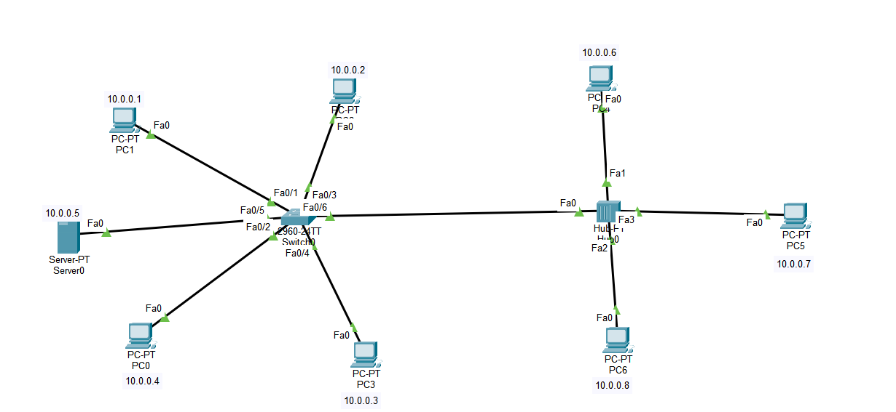

# 🔀 Analyzing ARP and ICMP using Switch and Hub 


> এই নোটটা আমার CN Lab এর কাজ থেকে বানানো — একই নেটওয়ার্কে **Switch** আর **Hub** পাশাপাশি রেখে দেখা হয়েছে ডেটা পাঠানোর সময় তাদের আচরণ কেমন আলাদা (Simulation Mode এ ARP/ICMP প্যাকেট ট্রেস করে)।


## Connection in Cisco Packet Tracer:



---

## 📑 Table of Contents

| # | Section |
|---|---------|
| 1 | [Overview](#overview) |
| 2 | [Devices Selection](#devices-selection) |
| 3 | [Cabling](#cabling) |
| 4 | [IP Configuration](#ip-configuration) |
| 5 | [Topology Labeling (Optional)](#labeling) |
| 6 | [Testing & Observation](#testing) |
| 7 | [Quick Reference Table](#quick-reference) |
| 8 | [Key Learnings](#learnings) |

---

<a id="overview"></a>
## 1️⃣ Overview

একটা **Switch** এর সাথে ৪টা PC আর ১টা Server, আর একটা **Hub** এর সাথে ৩টা PC — দুইটাকে একসাথে কানেক্ট করে একই IP সিরিজ (Class A) দিয়ে একটা নেটওয়ার্ক বানানো হয়েছে। উদ্দেশ্য: Simulation Mode এ প্যাকেট পাঠিয়ে দেখা Switch আর Hub এর পার্থক্য।

```
PC0, PC1, PC2, PC3, Server0 ---- Switch ---- Hub ---- PC4, PC5, PC6

           সবাই একই সিরিজে: 10.0.0.x  (Subnet Mask: 255.0.0.0)
```

---

<a id="devices-selection"></a>
## 2️⃣ Devices Selection (ওয়ার্কস্পেসে আনা)

নিচে বাম কোণার Device মেনু থেকে টেনে আনো:

1. **Switch**: `Network Devices > Switches > 2960` — মাঝখানে বসাও।
2. **Hub**: `Network Devices > Hubs > Hub-PT` — ডান পাশে বসাও।
3. **End Devices**: `End Devices > PC` — মোট ৫টা PC আর ১টা Server:
   - Switch এর সাথে: **৪টা PC + ১টা Server**
   - Hub এর সাথে: **৩টা PC**

---

<a id="cabling"></a>
## 3️⃣ Cabling (তার দিয়ে কানেকশন)

নিচে বাম কোণার বজ্রপাত (**Connections**) আইকনে ক্লিক করে **Copper Straight-Through** তার (কালো সোজা দাগ) নাও:

- PC/Server → Switch: `FastEthernet0` থেকে Switch এর যেকোনো পোর্টে।
- PC → Hub: `FastEthernet0` থেকে Hub এর যেকোনো পোর্টে।
- Switch → Hub: Switch এর যেকোনো পোর্ট (যেমন `Fa0/6`) থেকে Hub এর পোর্টে একই সোজা তার দিয়ে।

> ⚠️ **নোট:** Switch এর দিকের বাতি প্রথমে **কমলা** থাকবে, কিছুক্ষণ পর **সবুজ** হবে (STP negotiation এর কারণে)। Hub এর বাতি সাথে সাথেই সবুজ হয়ে যাবে।

---

<a id="ip-configuration"></a>
## 4️⃣ IP Configuration

প্রতিটা ডিভাইসে ক্লিক করে **Desktop → IP Configuration** এ গিয়ে বসাও (Class A রেঞ্জ ব্যবহার করা হয়েছে):

| Device | IPv4 Address | Subnet Mask |
|---|---|---|
| PC1 | `10.0.0.1` | `255.0.0.0` (auto) |
| PC2 | `10.0.0.2` | `255.0.0.0` |
| PC3 | `10.0.0.3` | `255.0.0.0` |
| PC0 | `10.0.0.4` | `255.0.0.0` |
| Server0 | `10.0.0.5` | `255.0.0.0` |
| PC4 | `10.0.0.6` | `255.0.0.0` |
| PC5 | `10.0.0.7` | `255.0.0.0` |
| PC6 | `10.0.0.8` | `255.0.0.0` |

> Subnet Mask ফিল্ডে ক্লিক করলেই অটোমেটিক `255.0.0.0` বসে যাবে।

---

<a id="labeling"></a>
## 5️⃣ Topology Labeling (Optional)

PC গুলোর উপরে IP লিখে রাখতে চাইলে:
- উপরের মেনুবার থেকে **Note** আইকন (হলুদ কাগজ) নাও।
- PC এর পাশে ক্লিক করে IP টাইপ করে দাও।

---

<a id="testing"></a>
## 6️⃣ Testing & Observation (Simulation Mode)

1. নিচে ডান কোণায় **Simulation** মোডে যাও।
2. ডান পাশের মেনু থেকে বন্ধ খাম (**Simple PDU**) আইকন নাও।
3. প্রথমে **PC1** এ ক্লিক করো, তারপর **PC5** (Hub এর PC) এ ক্লিক করো।
4. Simulation প্যানেলের **Play** বাটনে ক্লিক করো।

### 🔍 যা লক্ষ্য করার মতো:

| Device | আচরণ |
|---|---|
| **Switch** | প্যাকেট সরাসরি জানে এটা Hub এর দিকে যাবে — অন্য PC (PC0, PC2) কে ডিস্টার্ব করে না। |
| **Hub** | প্যাকেট পেয়ে তার সাথে যুক্ত **সবাইকে** (PC4, PC6) পাঠিয়ে দেয় — IP না মিললে তারা লাল ❌ দেখায়, শুধু PC5 গ্রহণ করে। |

---

<a id="quick-reference"></a>
## 7️⃣ Quick Reference Table

| Segment | Devices | Connected To | IP Range |
|---|---|---|---|
| Switch side | PC0, PC1, PC2, PC3, Server0 | Switch | `10.0.0.1 – .5` |
| Hub side | PC4, PC5, PC6 | Hub | `10.0.0.6 – .8` |
| Switch ↔ Hub | — | `Fa0/6` (Switch) ↔ Hub port | — |

---

<a id="learnings"></a>
## 8️⃣ Key Learnings

- 🧠 **Switch বুদ্ধিমান**: নির্দিষ্ট পোর্টে ডেটা পাঠাতে পারে (MAC address table এর মাধ্যমে) — unnecessary broadcast করে না।
- 📢 **Hub বোকা**: তার কাছে আসা ডেটা সবাইকে broadcast করে দেয়, কে গ্রহণ করবে তা বিবেচনা করে না।
- 🔗 একই IP সিরিজের মধ্যে Switch এবং Hub একসাথে ব্যবহার করে একটা বড় নেটওয়ার্ক তৈরি করা সম্ভব — কিন্তু performance ও traffic behavior ভিন্ন হবে।

---

⭐ *Personal lab note — CN Course, Packet Tracer.*